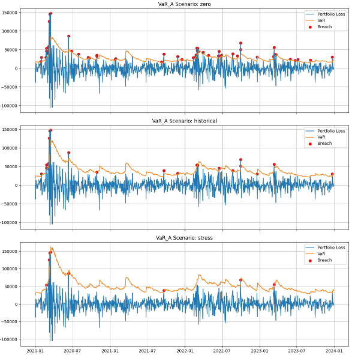
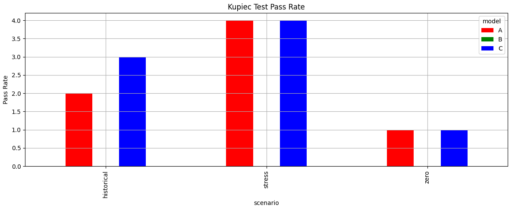

# Market-Portfolio-Risk

A market risk project comparing three volatility-adaptive VaR models across three correlation regimes for a four-asset GBP-denominated equity portfolio (Nike, Citigroup, Commerzbank, Volkswagen), with full Kupiec backtesting over 2020–2023. Includes a CAPM two-factor model validated against GARCH(1,1)-estimated index volatility.

## Features

- EWMA Volatility Calculation
- CAPM Beta Estimation
- GARCH (1,1) Parameter Estimation
- Normal and Student-t Distribution VaR
- Stress Testing Across Different Correlation Scenarios
- Kupiec LR Backtesting

## Model Framework

To estimate and validate daily portfolio Value-at-Risk (VaR) at 99% confidence level across three modelling frameworks and three correlation assumptions, using daily returns from 2020–2023 (backtesting period, 1,043 trading days) anchored on parameters estimated from 2010–2019 (in-sample period).

## Repository Structure

```
CreditMetrics-Python/
│
├── README.md                  # Project homepage
├── requirements.txt
├── .gitignore
│
├── data/
│   ├── correlation.csv
│   ├── thresholds.csv
│   ├── transition_matrix.csv
│   ├── valuation.csv
│   └── README.md
│
├── notebook/
│   └── creditmetrics_demo.ipynb
│
├── src/
│   ├── __init__.py
│   ├── config.py
│   ├── portfolio.py
│   ├── risk_metrics.py
│   ├── simulation.py
│   └── visualisation.py
│
├── tests/
│   ├── __init__.py
│   ├── test_creditmetrics.py
│   └── test_transition.py
│
├── figures/
│   ├── loss_distribution.png
│   └── migration_heatmap.png
│
└── docs/
    └── assumptions.md
```

## How to run

1. Clone the repo and create a virtual environment:
   ```bash
   git clone https://github.com/kobbyga/Market-Portfolio-Risk.git
   cd Market-Portfolio-Risk
   python -m venv venv
   source venv/bin/activate  # Windows: venv\Scripts\activate
   pip install -r requirements.txt
   ```

2. Launch Jupyter Notebook
- Open marketrisk_demo.ipynb
- Run all cells

## Portfolio and Parameters

| Parameter | Value |
|---|---|
| Assets | Nike (NKE), Citigroup (C), Commerzbank (CBK), Volkswagen (VOW) — all in GBP |
| Indices | S&P 500 (GBP), DAX (GBP) |
| Weights | Equal-weighted (25% each) |
| Portfolio Amount | £1,000,000 |
| VaR Confidence Level | 99% (α = 1%) |
| Backtesting Significance Level | 95% (α = 5%) |
| EWMA Lambda (λ) | 0.94 |
| In-sample period | January 2010 – December 2019 |
| Backtesting period | January 2020 – December 2023 |

## Key Charts

- Backtest Distribution, where Portfolio Loss > VaR = Breach
  

- Kupiec Test Pass Rate
  

